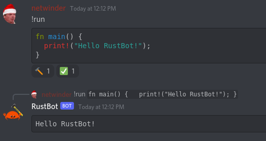

# RustBot

<p align="center">
  
</p>

*Bot is still under development and not ready for production use*

RustBot is a discord bot that executes whatever rust code you throw at it. In a nutshell, it is remote code execution as a service 😛. Some practical applications of a bot that executes whatever code you throw at it is for Code Golf on discord servers (this bot only does rust), or for educational purposes where you could show code examples in a conversation. 

Future work for this bot includes:
- **Multitenancy/Admin commands**: Allow admins to configure various settings, this would involve some form of database integration and adding additional contexts to bot messages.
- **Running the bot as a container**: This would be tricky, since we would effectively be DinD (Docker in Docker) which has security implications if you're using the root-based docker daemon. Currently, we only support userspace containerization through podman, and the bot runs outside of a container while using podman to manage containers.

## Configuration
Want to run your own RustBot? Great! I only have instructions to get you started developing locally on your own machine. In the future I will provide instructions for server deployments.

1. You need [Podman](https://podman.io/) installed.
2. Clone this repo, and add the `.env` file with your token
    ```
    DISCORD_TOKEN="YOUR_TOKEN_HERE"
    ```
3. Build the container with the `./BuildContainer` script
4. Build and run this project with `cargo run`

### Environment Variables
| Name | Description | Required? | Default Value |
|------|-------------|-----------|---------------|
| `DISCORD_TOKEN` | Discord bot token | Required | |
| `BOT_PREFIX` | Prefix to use for commands | Optional | `!` |
| `MAX_CONTAINER_RUNTIME` | Max amount of milliseconds before the container is killed | Optional | 5000 | 
| `CONTAINER_CPU` | Max amount of CPU to delegate to the container | Optional | `0.5` | 
| `CONTAINER_MEMORY` | Max amount of memory available to the container | Optional | `100m` |
| `CONTAINER_SWAP` | Max amount of swap available to the container | Optional | `5m` |

## Bot Commands
More commands should be coming soon, here is what we support at the moment:

- `!run`: runs arbitrary code. The command expects there to be a code block. 

    For example:
    > !run
    > 
    > \```rs
    > 
    > fn main() { println!("Hello RustBot"); }
    >
    > \```
    
    Or, without the language identifier:
    > !run
    > 
    > \```
    >
    > fn main() { println!("Hello RustBot"); }
    >
    > \```

    The bot will react with `🔨` to indicate your code is building / being executed, a `✅` to indicate the run is successful, and `❌` to indicate something went wrong. A reply will be posted by the bot with the standard output of your code. For the above example the response would be

    > ```
    > Hello RustBot
    > ```

    For edge cases such as if a response is too long, the response will be truncated to fit Discord's max message length. 

- `!ping`: Checks if the bot is working. The bot will react to your message and respond with PONG.

## Internals

All code compilation and execution is done in a container, which runs in userspace via [Podman](https://podman.io/) instead of Docker. It's worth noting that containers are not shared, the container only lives for the lifespan of the `!run` command. 

When your `!run` command followed by rust code is received by the bot, the bot will extract your code from the message and then base64 encode it. We *could* be very pedantic about escaping your code when it gets transferred to the container to prevent breakouts; however, base64ing it does that for us for free. The encoded string is then ran by a [trampoline](assets/container/trampoline) in the container which handles decoding and running your program.

The output of this would be the output of the rust program, which is ran by the helpful [runner](https://docs.rs/crate/runner/latest) which is great for running standalone rust files without scaffolding out a full project.

To prevent DOS attacks on the platform, we have some policies to prevent code like this from eating up our resources:
```rs
use std::{thread, time};
fn main() {
    // do nothing for a minute
    thread::sleep(time::Duration::from_millis(10000));
    println!("Hello rustbot!");
}
```